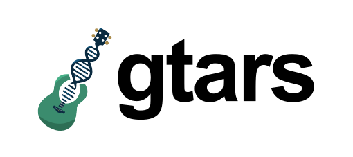

[](https://codecov.io/gh/databio/gtars)
[](https://crates.io/crates/gtars)

<h1 align="center">

</h1>


`gtars` is a rust project that provides a set of tools for working with genomic interval data. Its primary goal is to provide processors for our python package, [`geniml`](https:github.com/databio/geniml), a library for machine learning on genomic intervals. However, it can be used as a standalone library for working with genomic intervals as well. For more information, see the [public-facing documentation](https://docs.bedbase.org/gtars/) (under construction).


`gtars` provides these things:

1. A set of rust crates.
2. A command-line interface, written in rust.
3. A Python package that provides Python bindings to the rust crates.
4. An R package that provides R bindings to the rust crates.

## Repository organization (for developers)

This repository is a work in progress, and still in early development. This repo is organized like as a [workspace](https://doc.rust-lang.org/cargo/reference/workspaces.html). More specifically:

1. Each piece of core functionality is implemented as a separate rust crate and is mostly independent.
2. Common functionality (structs, traits, helpers) are stored in a `gtars-core` crate.
3. Python bindings are stored in `gtars-py`. They pull in the necessary rust crates and provide a Pythonic interface.
4. A command-line interface is implemented in the `gtars-cli` crate.

## Installation

To install `gtars`, you must first [install the rust toolchain](https://www.rust-lang.org/tools/install).

### Command-line interface

You may build the cli binary locally by navigating to `gtars-cli` and using `cargo build --release`. This will create a binary in `target/release/gtars` at the top level of the workspace. You can then add this to your path, or run it directly.

Alternatively, you can run `cargo install --path gtars-cli` from the top level of the workspace. This will install the binary to your cargo bin directory (usually `~/.cargo/bin`).

We feature-gate binary dependencies maximize compatibility and minimize install size. You can specify features during installation like so:

```
cargo install --path gtars-cli gtars-cli --features "uniwig tokenizers"
```

Finally, you can download precompiled binaries from the [releases page](https://github.com/databio/gtars/releases).

### Python bindings

You can install the Python bindings via pip. First, ensure you have a recent version of pip installed. Then run:

```bash
pip install gtars
```

Then, you can use it in Python like so:

```python
from gtars import __version__
print(__version__)
```

### Dev Python bindings


## Usage

`gtars` provides several useful tools. There are 3 ways to use `gtars`. 

### 1. From Python

Using bindings, you can call some `gtars` functions from within Python.

### 2. From the CLI

To see the available tools you can use from the CLI run `gtars --help`. To see the help for a specific tool, run `gtars <tool> --help`.

### 3. As a rust library

You can link `gtars` as a library in your rust project. To do so, add the following to your `Cargo.toml` file:

```toml
[dependencies]
gtars = { git = "https://github.com/databio/gtars/gtars" }
```

we wall-off crates using features, so you will need to enable the features you want. For example, to use the `gtars` crate the overlap tool, you would do:
```toml
[dependencies]
gtars = { git = "https://github.com/databio/gtars/gtars", features = ["overlaprs"] }
```

Then, in your rust code, you can use it like so:

```rust
use gtars::overlaprs::{ ... };
```